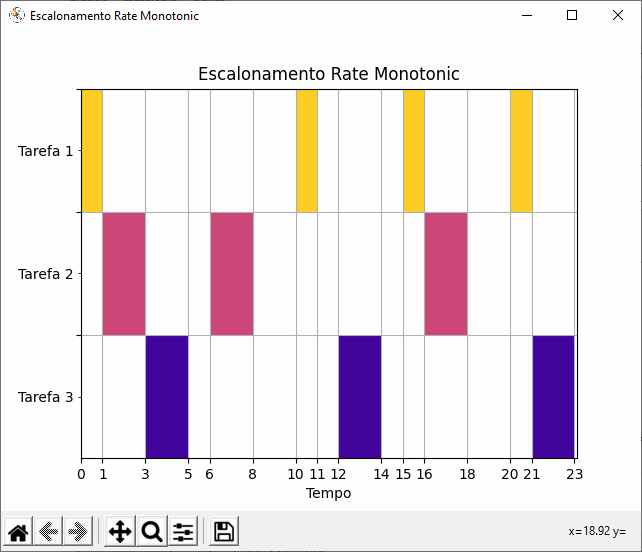
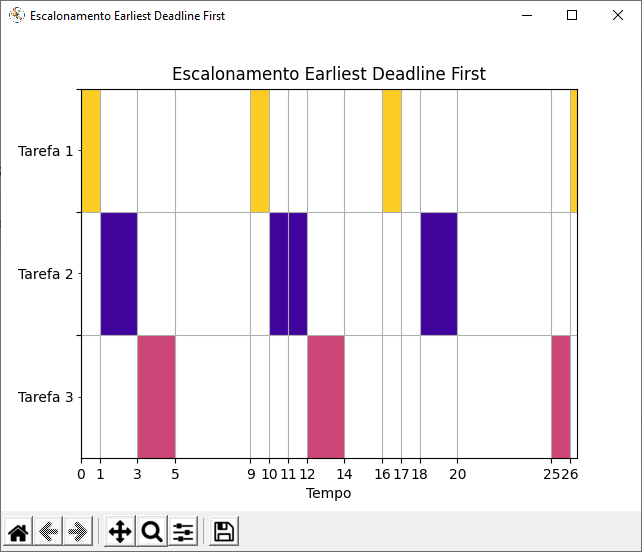

# Simulador de Eventos Discretos com Algoritmos RM e EDF

Este repositório contém um software que simula escalonamento de tarefas esporádicas em tempo real com os algoritimos Rate Monotonic e Earliest Deadline First.

## Exemplo de Entrada

```
Informe o número de tarefas: 
3     
Formato de entrada: instante_de_liberação tempo_de_computação período
Informe os parâmetros da tarefa 1:
0 1 5
Informe os parâmetros da tarefa 2: 
0 2 6
Informe os parâmetros da tarefa 3: 
0 2 7
Informe o algoritmo de escalonamento? (Escolhas: 1 = RM; 2 = EDF): 
2
```

## Exemplos de Diagramas de Gantt Gerados

Os diagramas podem ser explorados arrastando o ponteiro do mouse enquanto clica e utilizando o scroll do mesmo.

 



## Exemplo de Saída

---

<details>
  <summary>Clique para expandir</summary>
  
```
LUB =  0.7797631496846196
U =  0.819047619047619
R =  1
R =  3
R =  5

As tarefas são escalonáveis.

Tempo = 0 ; Seguinte = 1 ; A Fazer = 0 ; Atividade = Tarefa 1 ; Tarefas = [(0,1,5), (0,2,6), (0,2,7)]

Tempo = 1 ; Seguinte = 3 ; A Fazer = 0 ; Atividade = Tarefa 2 ; Tarefas = [(0,2,6), (0,2,7), (9,1,5)]

Tempo = 3 ; Seguinte = 5 ; A Fazer = 0 ; Atividade = Tarefa 3 ; Tarefas = [(0,2,7), (9,1,5), (10,2,6)]

Tempo = 5 ; Seguinte = 9 ; A Fazer = Infinito ; Atividade = Tarefa Ociosa ; Tarefas = [(9,1,5), (10,2,6), (11,2,7)]

Tempo = 9 ; Seguinte = 10 ; A Fazer = 0 ; Atividade = Tarefa 1 ; Tarefas = [(9,1,5), (10,2,6), (11,2,7)]

Tempo = 10 ; Seguinte = 11 ; A Fazer = 1 ; Atividade = Tarefa 2 ; Tarefas = [(10,2,6), (11,2,7), (16,1,5)]

Tempo = 11 ; Seguinte = 12 ; A Fazer = 0 ; Atividade = Tarefa 2 ; Tarefas = [(10,2,6), (11,2,7), (16,1,5)]

Tempo = 12 ; Seguinte = 14 ; A Fazer = 0 ; Atividade = Tarefa 3 ; Tarefas = [(11,2,7), (16,1,5), (18,2,6)]

Tempo = 14 ; Seguinte = 16 ; A Fazer = Infinito ; Atividade = Tarefa Ociosa ; Tarefas = [(16,1,5), (18,2,6), (25,2,7)]

Tempo = 16 ; Seguinte = 17 ; A Fazer = 0 ; Atividade = Tarefa 1 ; Tarefas = [(16,1,5), (18,2,6), (25,2,7)]

Tempo = 17 ; Seguinte = 18 ; A Fazer = Infinito ; Atividade = Tarefa Ociosa ; Tarefas = [(18,2,6), (26,1,5), (25,2,7)]

Tempo = 18 ; Seguinte = 20 ; A Fazer = 0 ; Atividade = Tarefa 2 ; Tarefas = [(18,2,6), (26,1,5), (25,2,7)]

Tempo = 20 ; Seguinte = 25 ; A Fazer = Infinito ; Atividade = Tarefa Ociosa ; Tarefas = [(26,1,5), (25,2,7), (28,2,6)]

Tempo = 25 ; Seguinte = 26 ; A Fazer = 1 ; Atividade = Tarefa 3 ; Tarefas = [(26,1,5), (25,2,7), (28,2,6)]

Tempo = 26 ; Seguinte = 27 ; A Fazer = 0 ; Atividade = Tarefa 1 ; Tarefas = [(26,1,5), (25,2,7), (28,2,6)]

Tempo = 27 ; Seguinte = 28 ; A Fazer = 0 ; Atividade = Tarefa 3 ; Tarefas = [(25,2,7), (28,2,6), (31,1,5)]

Tempo = 28 ; Seguinte = 30 ; A Fazer = 0 ; Atividade = Tarefa 2 ; Tarefas = [(28,2,6), (31,1,5), (38,2,7)]

Tempo = 30 ; Seguinte = 31 ; A Fazer = Infinito ; Atividade = Tarefa Ociosa ; Tarefas = [(31,1,5), (35,2,6), (38,2,7)]

Tempo = 31 ; Seguinte = 32 ; A Fazer = 0 ; Atividade = Tarefa 1 ; Tarefas = [(31,1,5), (35,2,6), (38,2,7)]

Tempo = 32 ; Seguinte = 35 ; A Fazer = Infinito ; Atividade = Tarefa Ociosa ; Tarefas = [(35,2,6), (38,2,7), (41,1,5)]

Tempo = 35 ; Seguinte = 37 ; A Fazer = 0 ; Atividade = Tarefa 2 ; Tarefas = [(35,2,6), (38,2,7), (41,1,5)]

Tempo = 37 ; Seguinte = 38 ; A Fazer = Infinito ; Atividade = Tarefa Ociosa ; Tarefas = [(38,2,7), (41,1,5), (47,2,6)]

Tempo = 38 ; Seguinte = 40 ; A Fazer = 0 ; Atividade = Tarefa 3 ; Tarefas = [(38,2,7), (41,1,5), (47,2,6)]

Tempo = 40 ; Seguinte = 41 ; A Fazer = Infinito ; Atividade = Tarefa Ociosa ; Tarefas = [(41,1,5), (47,2,6), (51,2,7)]

Tempo = 41 ; Seguinte = 42 ; A Fazer = 0 ; Atividade = Tarefa 1 ; Tarefas = [(41,1,5), (47,2,6), (51,2,7)]

Tempo = 42 ; Seguinte = 47 ; A Fazer = Infinito ; Atividade = Tarefa Ociosa ; Tarefas = [(47,2,6), (51,1,5), (51,2,7)]

Tempo = 47 ; Seguinte = 49 ; A Fazer = 0 ; Atividade = Tarefa 2 ; Tarefas = [(47,2,6), (51,1,5), (51,2,7)]

Tempo = 49 ; Seguinte = 51 ; A Fazer = Infinito ; Atividade = Tarefa Ociosa ; Tarefas = [(51,1,5), (51,2,7), (57,2,6)]

Tempo = 51 ; Seguinte = 52 ; A Fazer = 0 ; Atividade = Tarefa 1 ; Tarefas = [(51,1,5), (51,2,7), (57,2,6)]

Tempo = 52 ; Seguinte = 54 ; A Fazer = 0 ; Atividade = Tarefa 3 ; Tarefas = [(51,2,7), (56,1,5), (57,2,6)]

Tempo = 54 ; Seguinte = 56 ; A Fazer = Infinito ; Atividade = Tarefa Ociosa ; Tarefas = [(56,1,5), (57,2,6), (62,2,7)]

Tempo = 56 ; Seguinte = 57 ; A Fazer = 0 ; Atividade = Tarefa 1 ; Tarefas = [(56,1,5), (57,2,6), (62,2,7)]

Tempo = 57 ; Seguinte = 59 ; A Fazer = 0 ; Atividade = Tarefa 2 ; Tarefas = [(57,2,6), (64,1,5), (62,2,7)]

Tempo = 59 ; Seguinte = 62 ; A Fazer = Infinito ; Atividade = Tarefa Ociosa ; Tarefas = [(64,1,5), (62,2,7), (66,2,6)]

Tempo = 62 ; Seguinte = 64 ; A Fazer = 0 ; Atividade = Tarefa 3 ; Tarefas = [(64,1,5), (62,2,7), (66,2,6)]

Tempo = 64 ; Seguinte = 65 ; A Fazer = 0 ; Atividade = Tarefa 1 ; Tarefas = [(64,1,5), (66,2,6), (71,2,7)]

Tempo = 65 ; Seguinte = 66 ; A Fazer = Infinito ; Atividade = Tarefa Ociosa ; Tarefas = [(66,2,6), (71,1,5), (71,2,7)]

Tempo = 66 ; Seguinte = 68 ; A Fazer = 0 ; Atividade = Tarefa 2 ; Tarefas = [(66,2,6), (71,1,5), (71,2,7)]

Tempo = 68 ; Seguinte = 71 ; A Fazer = Infinito ; Atividade = Tarefa Ociosa ; Tarefas = [(71,1,5), (71,2,7), (74,2,6)]
```
    
</details>

---

##